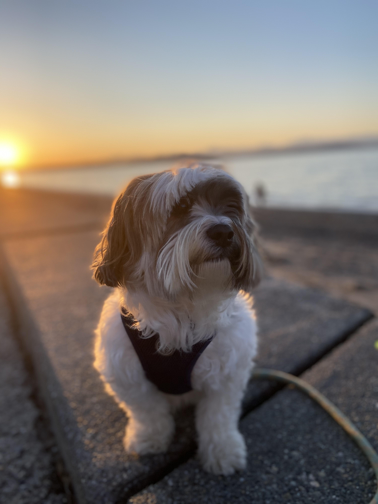

```{r setup, include=FALSE}
knitr::opts_chunk$set(echo = FALSE)
library(here)
```

# Introduction

## About Me | Personal 

* I was born in Seattle, Washington!
* __Brace yourself, my favorite foods are weird:__ cottage cheese, onions, and coffee
* My favorite species of animal is a tiger shark. The animal I love most is my dog, Jacques. 

```{r, echo = FALSE, out.width= "25%", fig.align = "center"}


```

## About Me | Academic

* Santa Clara University
* Majors: Biology and Environmental Sciences, Economics minor

# Data Science

## Course Topics |3 things I enjoyed learning about
 
1. How to use and navirgate Github (make repos, integrate with R studio, fork repos)! 
    + Github was totally unapproachable to me before the class and I never thought I would use it. Now, I'm excited to use it as a tool for my research.
2. Tips for reading in data and creating tidy data. I had no idea you could "scrape" data with a URL in your R code.
3. R markdown tools for publishing. 
    + I knew it was possible to write your thesis in RMarkdown but I thought it was clunky. I didn't realize all the formatting tools like font, citations, and formatting were available to make it easier. I plan to do this!

## Course Topics | 3 things I'd like to learn more about

1. Websites with multiple pages

2. How to make beautiful graphics

3. Creating maps (either simple ones to show study sites) or maps with data points

## {data-background="img/GNAM_STEVEN-00082600.jpg" data-background-size=cover}


